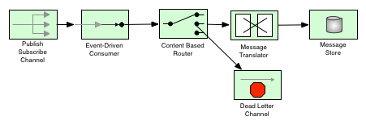
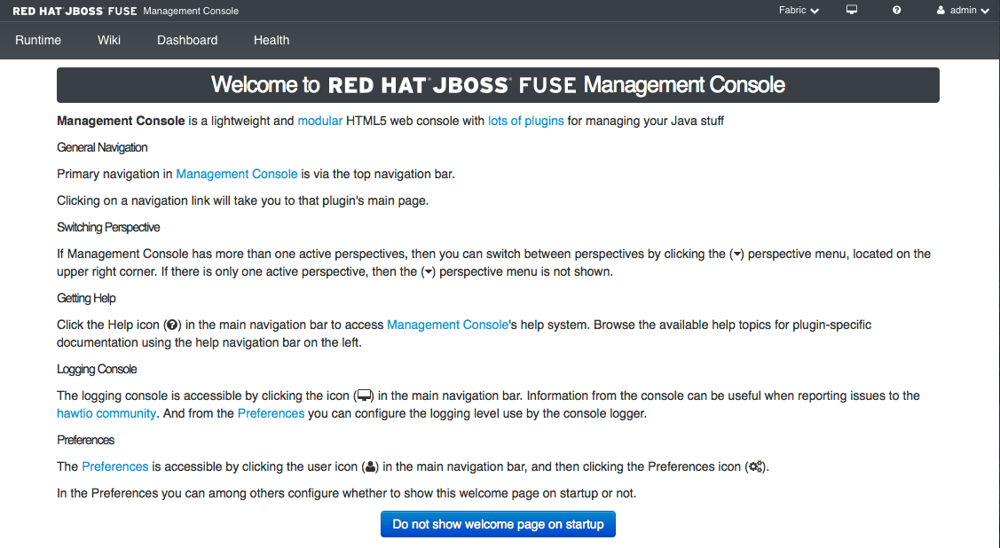
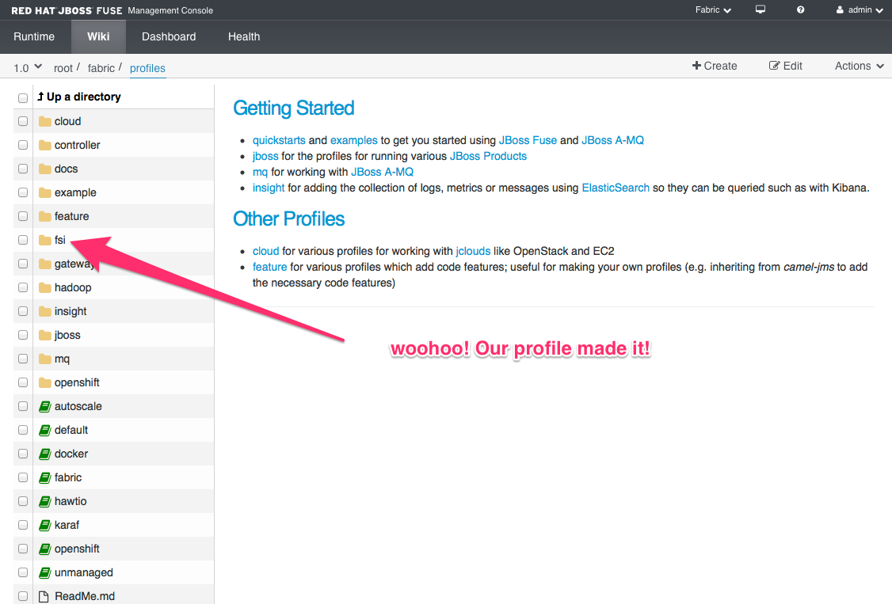
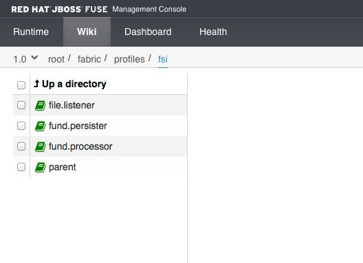
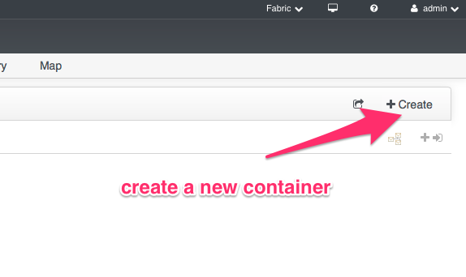
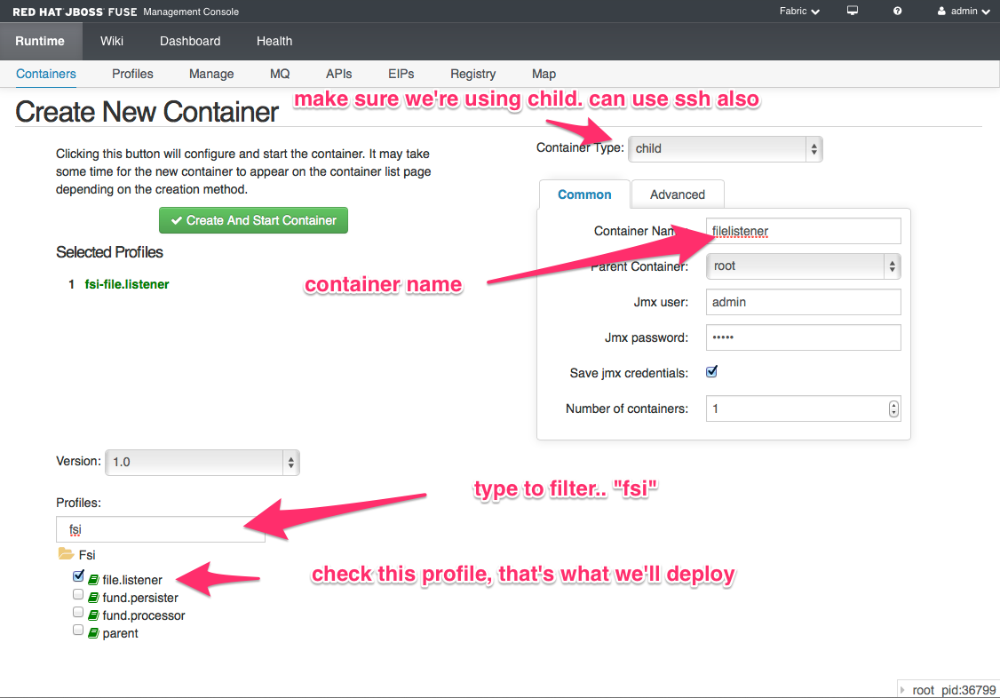
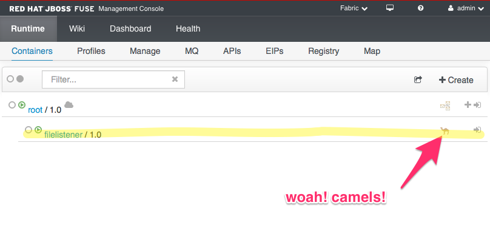

# A complete Fabric8/JBoss Fuse demo

So you want to see [Fabric8](http://fabric8.io)/[JBoss Fuse](http://www.jboss.org/products/fuse/overview/) in action, aye? Well I just demo'd this and thought, what the hell, let's spend a few more minutes making it so anyone can re-create this as a starting point. So here goes!

BTW, we're using [JBoss Fuse 6.1](http://www.jboss.org/products/fuse/overview/) in this demo, but you can use the community version, [Fabric8](http://fabric8.io) as well.

First... you're asking what are we going to demo?

Ultimately, the focus is going to be on a full developer lifecycle + devops management. The scenario is this: we are
an investment bank and we manage people's investment funds. We are trying to modernize our infrastructure by utilizing
an event-driven architecture to process new funds when they get created. However, on of our business partners can't/won't
update their communication strategies, so we're stuck with trying to modernize within some constraints. 

First, as our business partners deliver new-fund information via FTP/filesystem, we have to watch a file location. If a 
new file gets dropped into that location, we need to consume it as fast as possible and publish the payload as a a 
"New Fund" event onto our messaging bus.

Next, we have two consumers, but don't want to constrain ourselves with the architectural decisions we make right now
as we can easily add additional systems that are interested in new-fund events. So we use a JMS Topic to distribute
the new-fund event and have our consumers independently consume this stream. One consumer is interested in "Global" 
funds so it can store it to a database, while the other consumer needs to do some basic transformations and put it
into a file directory.

Our basic flows look like this:

File Listener:

Fund Persisteer:

Fund Processor:

So we have these microservices that perform a "Single Responsibility" and participate in a event-driven architecture.
But now we need to deploy them, version, and manage the deployments somehow. At last, the business cannot make money
from our development efforts until the code is deployed so we need a consistent, automated, managed approach to deploying
our solutions. So that's where the "Fuse Fabric" or [Fabric8](http://fabric8.io) piece fits into the picture.

## Setting up the demo

So let's get started.

First note, when you download JBoss Fuse (I will use JBoss Fuse and Fabric8 as interchangeable entities for the purposes
of this demo), you should edit $FUSE_HOME/etc/users.properties to contain a valid user. You can uncomment the last
line so that -admin=admin,admin_ user is enabled.

To start Fuse, run this command:

    $FUSE_HOME/bin/fuse
    
This will start the ESB container in a standalone mode. You could deploy the parts of the demo into this standalone
container if you don't wish to use Fabric. You'd have to build the maven project so that the modules are installed
into the local maven repository:

    mvn clean install
 
Once you've built the project and installed into the local maven repo, you can run this from the JBoss Fuse shell prompt:

    JBossFuse:karaf@root> osgi:install -s mvn:com.redhat.poc.fsi/file-listener/1.0-SNAPSHOT
        
This would install the bundle assocaited with the file-listener module.

Another tip.. you can run each module stand-alone as well by running this command from within the module's directory.
For example, to start up the _file-listener_ module stand alone:

    $SRC_HOME/file-listener $ mvn camel:run
    
This will bootstrap the Camel context in the same JVM that's running Maven.. pretty useful for showing how simple, lightweight
 and container agnostic Camel can be.

But we want to demo the Fabric8/Fuse Fabric pieces, so let's continue. 

### Setting up the external DB (Apache Derby)
Our demo uses an external database, but don't worry it's pretty easy to set that up. We use [Apache Derby](http://db.apache.org/derby/) so download it [from here](http://db.apache.org/derby/releases/release-10.10.2.0.cgi). All you have to do is unpack it (zip/tar) to a location and change directory into the root folder, $DERBY_HOME.

You'll need to start the network listener so that the client can connect. Just run this command:

    > $DERBY_HOME/bin/startNetworkServer -h localhost -p 1527

Then you can use the derby _ij_ command promopt to interact with the server and install the required tables.

The DB location must match that in the JDBC URI that's specified in [SqlMapConfig.xml](../fund-persister/src/main/resources/SqlMapConfig.xml). 

So for example, on my machine we do this:

    > $DERBY_HOME/bin/ij

    ij> connect 'jdbc:derby://localhost:1527//Users/ceposta/temp/opp.db;create=true';
    ij> run '/Users/ceposta/dev/poc/fsi/workspace/fsi-poc/fund-persister/src/main/resources/sql/tables.sql';
    ij> show tables;
    ij> select * from funds;
    
    
You should see very clearly that there are no rows in the table because we haven't created any and the microservices
that handle new-fund events haven't processed anything.

### Build the profiles for the deployments

You'll need to create a fabric for Jboss Fuse. When we started it earlier, it was really just a standalone ESB container,
but we want to enable the devops/management tools. So type this:

    JBossFuse:karaf@root> fabric:create --clean --wait-for-provisioning
    
This will create a new Fabric registry and turn the container into a Fabric ensemble member. The shell should block until everything is all set up. You should see the following if everything was successful:

    Waiting for container: root
    Waiting for container root to provision.
    Using specified zookeeper password:admin
    
NOTE: If you're using Fabric8, you don't need to "create a fabric" as this is the default out of the box, i.e., a Fabric is enabled once you start the container.

You can then navigate to the webconsole url: http://localhost:8181, and should see the JBoss Fuse dashboard:

Now that you have a fabric server running, we're going to use the [fabric8-maven-plugin](http://fabric8.io/gitbook/mavenPlugin.html) to create our profiles and upload the profiles to fabric so we can deploy applications. If you're not familiar with profiles, please see the JBoss Fuse documentation or the [community docs at the Fabric8 website](http://fabric8.io/gitbook/index.html).

BTW, you'll need to configure your settings.xml. See [the fabric8-maven-plugin](http://fabric8.io/gitbook/mavenPlugin.html) for more, but here's the snippet from mine:

    <servers>
      ...
      <server>
        <id>fabric8.upload.repo</id>
        <username>admin</username>
        <password>admin</password>
      </server>
      ...
    </servers>
    
    
Then you can navigate to the root of the source (this project source) and run this command:

    mvn fabric8:deploy
    
This will use the fabric8-maven-plugin to create the profiles and upload them to JBoss Fuse.

Now click the "Wiki" tab of the JBoss Fuse webconsole and you should see the _fsi_ profiles got 
properly pushed to the Fabric registry:

The wiki profiles are organized in a hierarchical tree structure, so we can see that the top-level profile name made it
but click the _fsi_ entry to expand it and see the rest of the profiles:

### Deploy the profiles to running containers

You can now click back to the "Runtime" tab to get a list of all the containers in our Fabric. At the moment, there really
should be only one container, the _root_ container:

Off to the top right, you should see a "Create" icon. Click that to create a new container:

Now you need to assign a name, and chose a profile that will be applied to this container. See this guide:

Then click the "Create And Start Container button" If everything went okay, you should see your new container:

Now repeat this for the other two profiles, fund.persister and fund.processor
